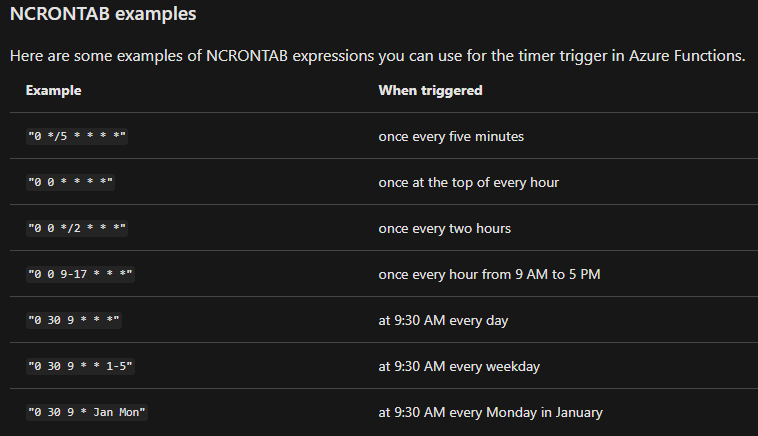

# Azure Function Cron Expressions 

Azure Function Timer Triggers are configured by using cron expressions. Infinitely useful. Insanely confusing. I hate them.

Here's a couple links to documentation:

-  https://docs.microsoft.com/en-us/azure/azure-functions/functions-bindings-timer 
-  https://github.com/atifaziz/NCrontab 
-  https://en.wikipedia.org/wiki/Cron#CRON_expression 

The expression has 6 slots that represent.

- second
- minute
- hour
- day of month
- month
- day of week 

So what's the confusing part? Well for starters, it's not well documented that those cron expressions are in UTC. I know, the page I linked to above spells it out, but trust me, it isn't always obvious. Many of the examples are set up to trigger every hour or every 5 minutes, in which case it wouldn't matter. However I'm often using timer triggers to schedule processes around a company's daily work. People don't show up to work and schedule tasks around UTC and translating schedules back and forth between local time zones and UTC just introduces the potential for mistakes. 

But the biggest problem with scheduling timer triggers in UTC might be this: Twice a year your offset from UTC can shift.  People more or less automatically adjust their work schedules to daylight savings time, but UTC based cron expressions do not shift to reflect daylight savings time. That makes them great for server logs and for coordinating workloads between datacenters, but terrible if you have a function that is supposed to send shift relevant information to workers just prior to their work day.

The solution is simple enough and also detailed in the documentation above. Add in an Application setting for your function configuration that defines the time zone for your function runtime. 

WEBSITE_TIME_ZONE:Eastern Standard Time

 https://docs.microsoft.com/en-us/previous-versions/windows/it-pro/windows-vista/cc749073(v=ws.10)?redirectedfrom=MSDN 

The caveat here is that the setting affects your entire function app. You can't mix and match UTC and local time zone based triggers within the same function app, but hopefully that's a fairly niche situation. 