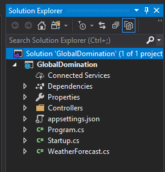

# Global Domination Project Setup

Global Domination is a demo project for creating a geo-distributed site. This post is the quick start on creating the initial projects. I'm using Visual Studio 2019. 

The primary project is a an ASP.NET Core Web Application (C#). Mine shows up in the recent project templates, but you may need to just search for it.

Give it a name and location.

Leave Authentication to 'No Authentication' and uncheck the 'Configure for HTTPS' box. These things are all great, but if this is your first time though, they are only a distraction. Ignore them for now, I'll try to get another post together later on on how best to take advantage of them.

Cool - initial project is up:

Now add a new project. This time it is a Class Library (.NET Core) C# project. Again, mine shows in the recent project templates, but you may need to search for it.

Call it database

Result

