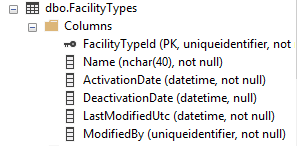
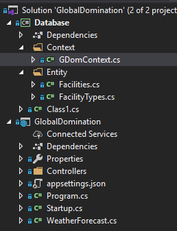

# Global Domination Database Scaffold

I love the EFCore Code First Migrations capabilities. However, when it comes to initially creating a database from scratch, I still find it faster to create the database first in a UI and scaffold it backward into code. In this case, I've created a table of facilities that represents urgent care facilities. Check out [Government Datasets](./Government Datasets) for info on how I came across the information. 

## Create the database

I created two tables, Facilities and FacilityTypes.



```
CREATE TABLE [dbo].[Facilities](
	[FacilityId] [uniqueidentifier] NOT NULL,
	[Name] [nvarchar](50) NULL,
	[AddressLine1] [nvarchar](60) NULL,
	[AddressLine2] [nvarchar](60) NULL,
	[City] [nvarchar](40) NULL,
	[State] [nvarchar](40) NULL,
	[PostalCode] [nvarchar](10) NULL,
	[ActivationDate] [datetime] NULL,
	[DeactivationDate] [datetime] NULL,
	[LastModifiedUTC] [datetime] NULL,
	[ModifiedBy] [uniqueidentifier] NULL,
	[Telephone] [nvarchar](10) NULL,
	[County] [nchar](40) NULL,
	[Directions] [nchar](250) NULL,
	[FacilityTypeId] [uniqueidentifier] NULL,
	[Latitude] [float] NULL,
	[Longitude] [float] NULL,
 CONSTRAINT [PK_Facilities] PRIMARY KEY CLUSTERED 
(
	[FacilityId] ASC
)WITH (PAD_INDEX = OFF, STATISTICS_NORECOMPUTE = OFF, IGNORE_DUP_KEY = OFF, ALLOW_ROW_LOCKS = ON, ALLOW_PAGE_LOCKS = ON) ON [PRIMARY]
) ON [PRIMARY]
GO

ALTER TABLE [dbo].[Facilities] ADD  CONSTRAINT [DF_Facilities_FacilityId]  DEFAULT (newid()) FOR [FacilityId]
GO
```

```
CREATE TABLE [dbo].[FacilityTypes](
	[FacilityTypeId] [uniqueidentifier] NOT NULL,
	[Name] [nchar](40) NOT NULL,
	[ActivationDate] [datetime] NOT NULL,
	[DeactivationDate] [datetime] NULL,
	[LastModifiedUtc] [datetime] NOT NULL,
	[ModifiedBy] [uniqueidentifier] NOT NULL,
 CONSTRAINT [PK_FacilityTypes] PRIMARY KEY CLUSTERED 
(
	[FacilityTypeId] ASC
)WITH (PAD_INDEX = OFF, STATISTICS_NORECOMPUTE = OFF, IGNORE_DUP_KEY = OFF, ALLOW_ROW_LOCKS = ON, ALLOW_PAGE_LOCKS = ON) ON [PRIMARY]
) ON [PRIMARY]
GO

```

## Add the NuGet Packages

To the Database & GlobalDomination projects, add these NuGet packages:

- Microsoft.EntityFrameworkCore.SqlServer -3.1 is current at this time
- Microsoft.EntityFrameworkCore.Design

## Scaffold Entities

Don't forget to add the reference in the GlobalDomination project to your Database project.

Then run your scaffolding command. Mine was this, which created a context class called GDomContext and two Entities. from my local database which I had named 'GlobalDomination'

```
PM> dotnet-ef dbcontext scaffold "Server=(local); Database=GlobalDomination;integrated security=True" "Microsoft.EntityFrameworkCore.SqlServer" -s GlobalDomination -p Database -c GDomContext -o Entity --context-dir Context
```

