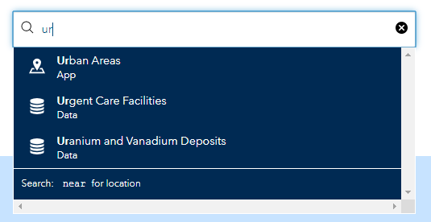
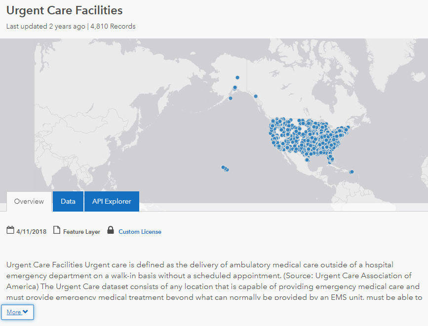
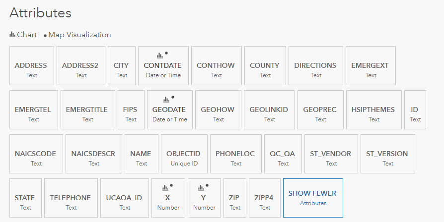

# Government Datasets

I was putting together a some supporting code for a [CodeMash](https://www.codemash.org/) talk and I needed some example data. Specifically I was looking for a large set of facility addresses and for my example I honed in on urgent care facilities. I thought about getting cute and trying to extract them from Bing or Google's mapping services, but after a quick dive into the APIs, I realized that would be a mini project on it's own and I didn't want to [shave the yak](https://www.techopedia.com/definition/15511/yak-shaving) on this one. I tried some additional searching for a while hoping to come across a packaged up .csv of urgent care addresses. Most of my results that I found were the typical 'our locations' page specific to one or another larger healthcare organization, but then I came across this gem: [Homeland Infrastructure Foundation Level Data](https://hifld-geoplatform.opendata.arcgis.com/)

This site is put maintained by the Department of Homeland Security and the data is freely available. It gives you the ability to search for datasets. One you search and select a dataset, for example Urgent Care Facilities (perfecto).

You get to see an interactive map of the data and get a description of the dataset itself, including details of every field within the set. Or you can just jump straight to the download and explore it locally.

If you're curious what they have, you can [download a catalog](https://gii.dhs.gov/hifld/content/hifld-data-catalog) of all of the available datasets, or perhaps more consumable, just browse the site and start exploring by category.

](Government Datasets.assets/image-20191218101100298.png)